# ILA
## CPLD clock signals 
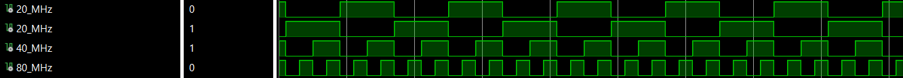
## After turning off and on the electronics - CSTR pattern changes
- I did not observe any correlations between the signals. Signals are independent.  
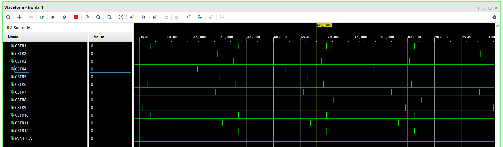
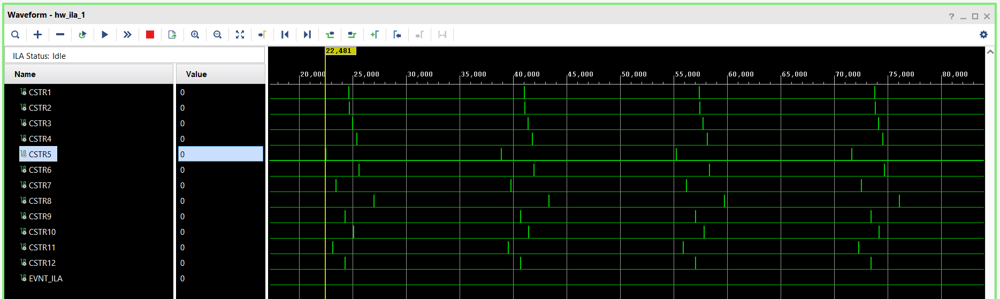

## CSTR and mt_cou
- ILA clock is equal 320[MHz]
- We can see that the **CSTR** signal from the CPLD appears only at a specific moment, namely when the **mt_cou** signal equals “0”.
- Also we can be observed that the CSTR signal is active for only four ILA clock cycles. 
	- 3.125[ns] * 4[cycles] = 12.5[ns]. 
- CSTR1 and mt_cou
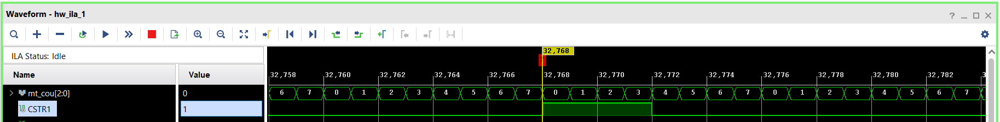
- CSTR2 and mt_cou

- CSTR3 and mt_cou

- CSTR4 and mt_cou

- CSTR5 and mt_cou
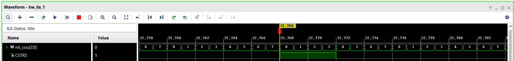
- CSTR6 and mt_cou

- CSTR7 and mt_cou

- CSTR8 and mt_cou

- CSTR9 and mt_cou

- CSTR10 and mt_cou

- CSTR11 and mt_cou
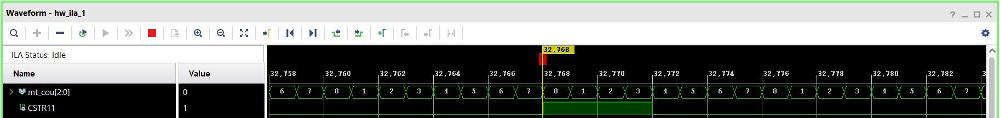
- CSTR12 and mt_cou
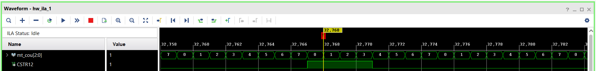

## CFD and CFD in gate
- CFD_in gate  -> ENA(Altium),  i_gate_latch(VHDL)
-  CFD  ->  STR(Altium), i_cfd(VHDL)
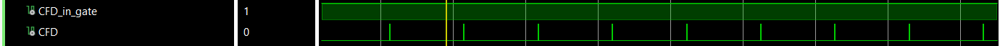

# ADC Calibrations
- Before ADC zero calibrations (gate is ~5.5 ns)
	- СFD in gate = 0 
		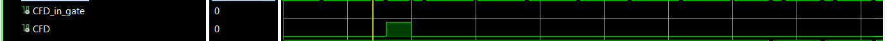
		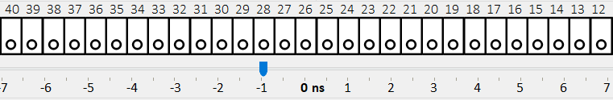
	- CFD in gate = 1 
		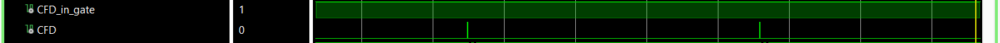
		
	- СFD in gate = 1
		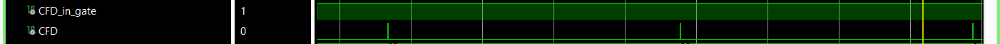
		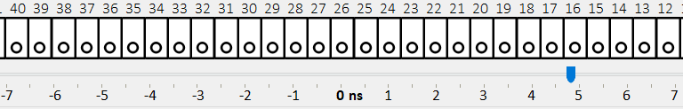
	- СFD in gate = 0
		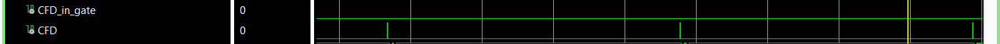
		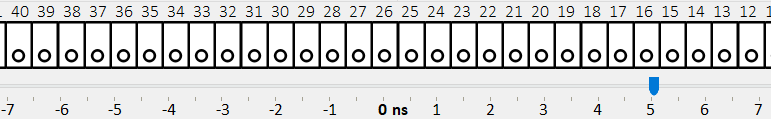
	- Notes
		- 12500  ~  ( -2.5 ns <-> 3ns ) 
		- 11000  ~  ( -4 ns <-> 1.5ns )
		- 9000   ~   ( -6 ns <-> -0.5ns )
# Select ADC A, ADC B, or both

| BC        |                                                                                                                          |
| --------- | ----------------------------------------------------------------------------------------------------------------------------------------------------- |
| 100 BC    | ADCA or ADCB - To choose which one to use, set it to 1 or 2.  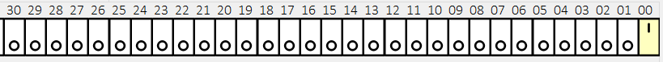  |
| 101 BC | ADCA and ADCB                                                                                                                                         |

# STR and baseline
- ILA clock is 320[Mhz]
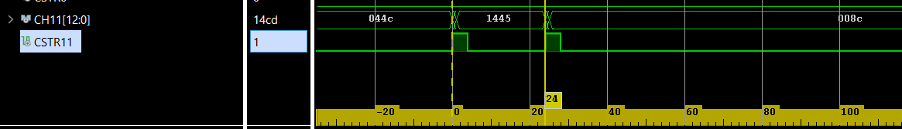
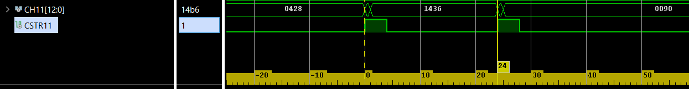

- Second STR is baseline (ADC 0) (Before that, the calibration was on (ADC 1).)
# Baseline 
- If STR (baseline) arrives on channel every 16.736 (320 MHz), it means that channel (ADC A side or ADC B side) updates its baseline every 16.376 x 2 -> 51.175[us] x 2 = 102.35[us]. (in the best case)
# UCF
## ADC A - OK 
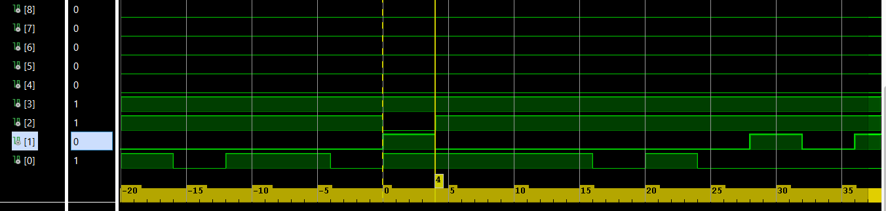

## ADC B - OK
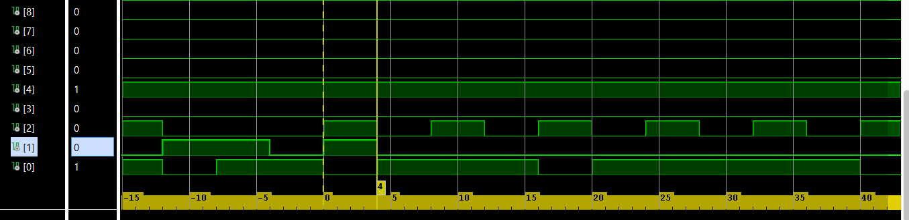

## DI - OK
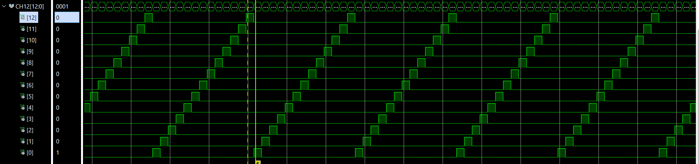

## Clock 80 - OK
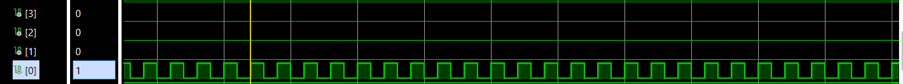

## EV  - Not OK
cpld - set all pins ZERO
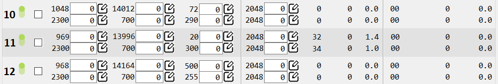
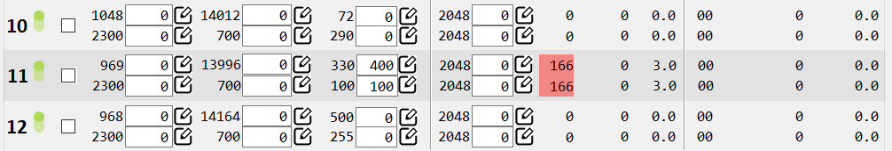
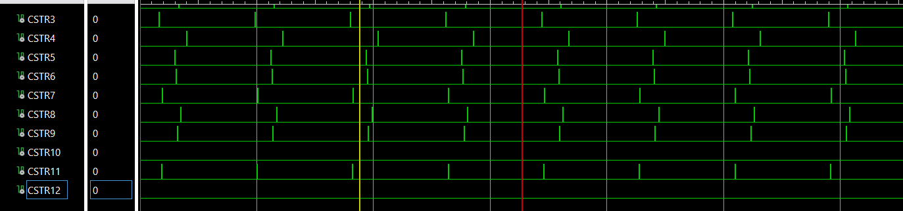

#  Code from Warsaw gitub - simulation
EVOUT will be logical 1 if and only if c_count = "1111111" and cal_str ="1". But this conditional is true only 25 ns  (From this code it follows that EVNT have to go every 256 clock cycle (80 MHZ)) )
- cal_str
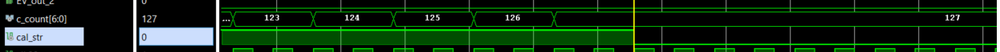
- EV - every 256 clock cycle
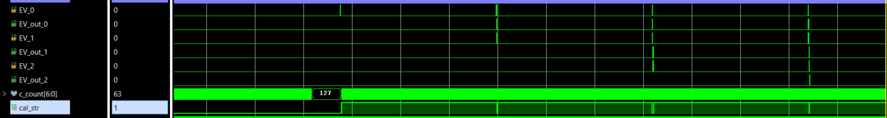
- EV - every 300 clock cycle
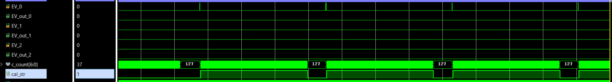

# PM baseline register
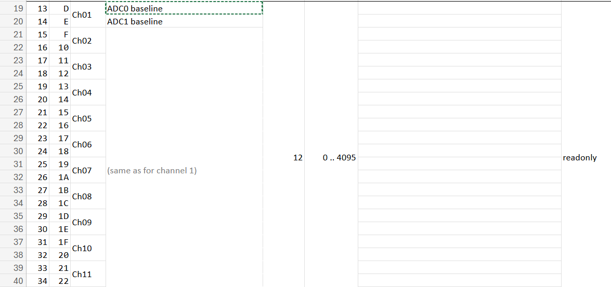
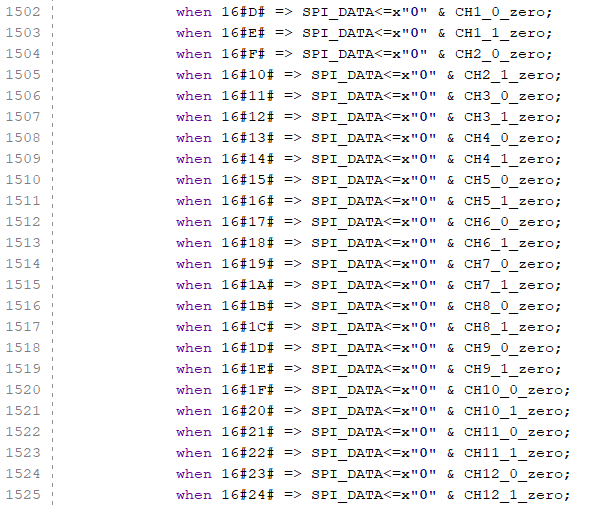
